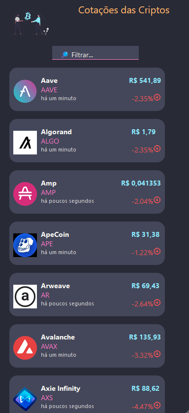

# :zap: Expo Criptomoeda

* App React-Native/Expo para exibir cotações de Criptomoedas a partir da API Coingecko
* Tutorial baseado em [Made With Matt](https://www.youtube.com/watch?v=0JG1_9xqC6A) - veja [:clap: Code Inspiration](#clap-inspiration) abaixo
* **Observação:** para abrir os links em uma nova janela, utilize: _ctrl+click on link_

## :page_facing_up: Tabela de Conteúdo

* [:zap: Expo Criptomoedas](#zap-react-native-cryptos)
  * [:page_facing_up: Tabela de Conteúdo](#page_facing_up-table-of-contents)
  * [:books: Informações Gerais](#books-general-info)
  * [:camera: Screenshots](#camera-screenshots)
  * [:signal_strength: Tecnologias](#signal_strength-technologies)
  * [:floppy_disk: Setup](#floppy_disk-setup)
  * [:computer: Code Example by Fazt Code](#computer-code-example-by-fazt-code)
  * [:cool: Features](#cool-features)
  * [:clipboard: Status & To-do list](#clipboard-status--to-do-list)
  * [:clap: Inspiração](#clap-inspiration)
  * [:file_folder: Licença](#file_folder-license)
  * [:envelope: Contato](#envelope-contact)

## :books: General info

* Dados das Cotações das Criptomoedas da [CoinGecko API](https://www.coingecko.com/en/api) Ela não requer uma chave!
* React [useEffect hook](https://reactjs.org/docs/hooks-effect.html) utilizado para obter o fetch dos dados
* React [useState hook](https://reactjs.org/docs/hooks-state.html) utilizado para inicializar as criptomoedas, o status do refresh e da busca

## :camera: Screenshots

## :signal_strength: Technologies

* [Expo v44](https://docs.expo.io/) framework & platform for universal React applications, installed globally
* [React Native v0.67.4](https://reactnative.dev/) to create native app for Android and iOS
* [react-native-web v0.17.7](https://www.npmjs.com/package/react-native-web) React Native Components and APIs for the Web.
* [React v17](https://reactjs.org/) JavaScript library for building user interfaces

## :floppy_disk: Setup

* Rode `npm i` ou `yarn` para instalar as dependências
* Execute `npm i -g expo-cli` para instalar o Expo CLI globalmente
* Rode `expo start` para iniciar a aplicação expo localmente

## :computer: Code Example by Fazt Code

* Code by Fazt Code to display Cryptocurrency data. Includes ternery expression to show price change data in green or red

## :cool: Features

* Expo bar code used to connect mobile to project. The Expo framework is easy to use.
* Android Studio simulation on mobile device

## :clipboard: Status & To-do list

* Status: Working
* To-do: Nothing.

## :clap: Inspiration

* [Fazt Code: React Native & CoinGecko | Aplicación de Precios de Criptomonedas](https://www.youtube.com/watch?v=k9ptn9zNHng&t=38s) in Spanish

## :file_folder: Licença

* MIT

## :envelope: Contato

* Repositório criado por [Prof. Ricardo Leme](https://github.com/fatecitu), email: ricardo.leme@fatec.sp.gov.br
